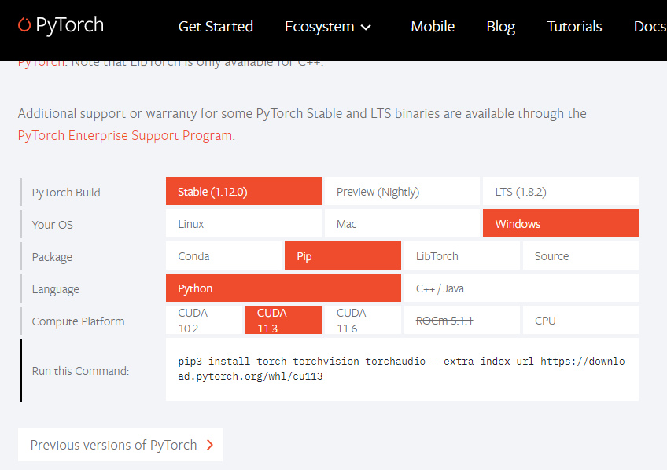

# Speech Recognition with Pytorch using Recurrent Neural Networks

Hello, today we are going to create a neural  network with **Pytorch** to classify the voice.

In the previous blog post we have studied this case by using **Tensorflow**  with Convolutional Neural networks.

This time we will use **LSTM** (Long Short-Term Memory) is adopted for classification, which is a type of **Recurrent Neural Network**.

### Installation of Conda

First you need to install anaconda at this [link](https://www.anaconda.com/products/individual)


in this location **C:\Anaconda3** , then you, check that your terminal , recognize **conda**

```
C:\conda --version
conda 4.12.0
```

## Environment creation

The environments supported that I will consider is Python 3.7, 

I will create an environment called **keras**, but you can put the name that you like.

```
conda create -n pytorch python==3.7
```

and then close and open the terminal

```
conda activate pytorch  
```

You will have something like this:

```
Microsoft Windows [Version 10.0.19044.1706]
(c) Microsoft Corporation. All rights reserved.
C:\Users\ruslanmv>conda activate keras
(pytorch) C:\Users\ruslanmv>
```

then in your terminal type the following commands:

```
conda install ipykernel
```

then

```
python -m ipykernel install --user --name pytorch --display-name "Python (Pytorch)"
```

Then we install **Pytorch**,  from the original source "https://pytorch.org/" we can install the one that matches with your computer.



To know the cuda version

```
nvcc --version
```

you can have see this

```
nvcc: NVIDIA (R) Cuda compiler driver
Copyright (c) 2005-2021 NVIDIA Corporation
Built on Wed_Jul_14_19:47:52_Pacific_Daylight_Time_2021
Cuda compilation tools, release 11.4, V11.4.100
Build cuda_11.4.r11.4/compiler.30188945_0
```

I'm using Stable(1,12), Windows Pip, Python 3.7, CUDA 11.3

```
pip3 install torch torchvision torchaudio --extra-index-url https://download.pytorch.org/whl/cu113
```

If you will work with **Data Science Audio Projects** I suggest install additional libraries:

```
pip install  matplotlib sklearn scipy numpy  jupyter opencv-python
```

with some  audio packages 

```
pip install librosa soundfile  pynput sounddevice gtts pyttsx pyttsx3 
```

then open the **Jupyter notebook** with the command

```
jupyter notebook&
```

then click New and Select your Kernel called **Python (Pytorch)**

And now we are ready to start working.